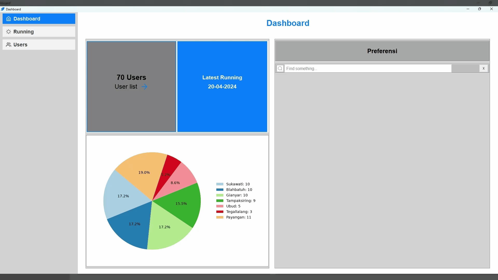

# Python Tkinter GUI Learning Project

## About

This project is a learning project focused on building a Graphical User Interface (GUI) using Python and Tkinter. The application is still in its early development stage and serves as a starting point for exploring GUI design, layouts, widgets, and basic interactions in Python.

The current design is not yet fully finalized and mainly represents the initial structure and interface concept.

## Tech Stack
* Python
* Tkinter
* Matplotlib
